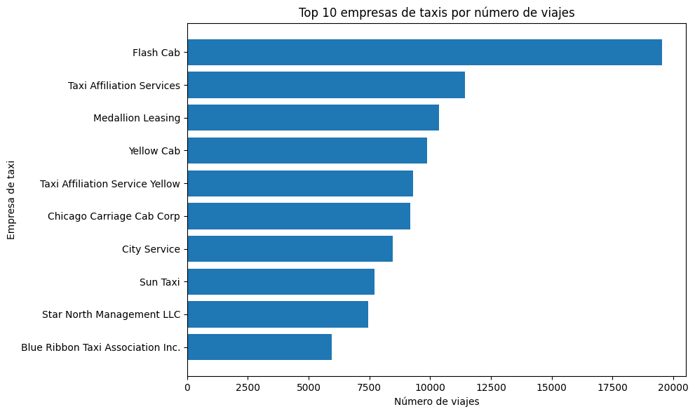
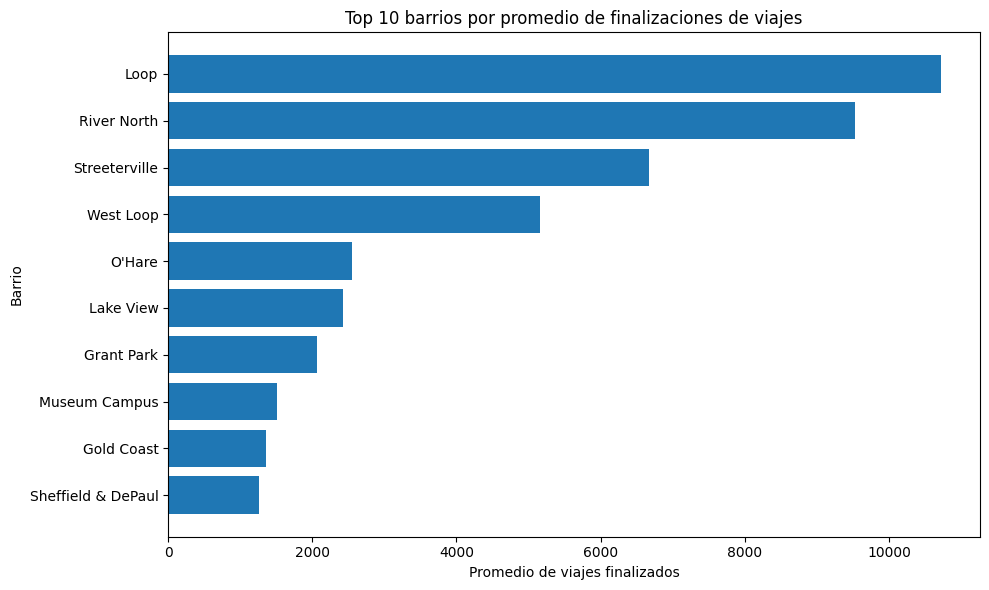
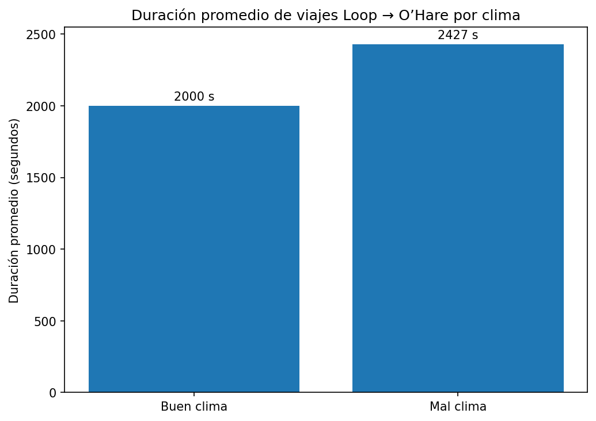

# Chicago Taxi Trips Analysis

## Project Overview

This project analyzes taxi trip data in Chicago to identify demand patterns by taxi company, high-activity destination areas, and differences in trip duration from Loop to O’Hare International Airport under different weather conditions.

## Business Context

A ride-sharing company wants to better understand the local transportation market before making operational decisions. The analysis focuses on three key questions:

1. Which taxi companies register the highest number of trips?
2. Which Chicago neighborhoods receive the highest average number of drop-offs?
3. Does the average duration of trips from Loop to O’Hare change on Saturdays with bad weather?

## My Contribution

* Reviewed data quality, data types, missing values and duplicates.
* Analyzed taxi trip distribution by company.
* Identified the top 10 neighborhoods by average number of trip drop-offs.
* Converted date fields to datetime format and validated Saturday records.
* Compared average trip duration between good and bad weather conditions.
* Applied Levene’s test to evaluate variance equality.
* Applied an independent two-sample t-test.
* Interpreted results from a business and operational perspective.

## Tools Used

* Python
* pandas
* matplotlib
* scipy
* SQL
* Exploratory Data Analysis
* Hypothesis Testing

## Key Findings

Flash Cab registered the highest number of taxi trips, showing a clear lead over the rest of the companies analyzed.

The neighborhoods with the highest average number of drop-offs were Loop, River North, Streeterville and West Loop, which are areas associated with strong commercial, tourist and business activity.

O’Hare appeared among the main destinations, confirming the operational relevance of airport-related trips.

Trips under bad weather conditions had a higher average duration than trips under good weather conditions. The t-test returned a p-value below 0.05, so the null hypothesis was rejected. This indicates a statistically significant difference between the two groups.

## Conclusion

The analysis shows that taxi demand in Chicago is concentrated among a few companies and in high-activity urban areas. It also provides statistical evidence that average trip duration from Loop to O’Hare changes on Saturdays with bad weather.

This result should be interpreted as an association, not absolute causality, since other factors such as traffic, time of day and demand levels may also influence trip duration.

## Visual Evidence

### Top Taxi Companies by Number of Trips

### Top Destination Neighborhoods

### Average Trip Duration by Weather Condition

## Notebook

The clean notebook version is available in this repository:

`zuber_taxis_chicago_portfolio_clean.ipynb`
